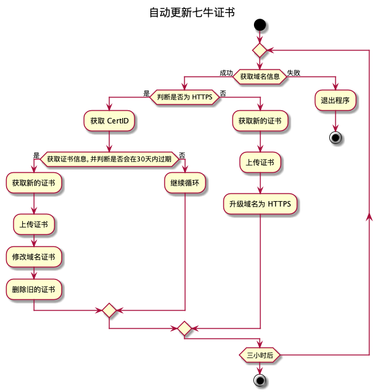

# 七牛 CDN 证书自动化工具

## 安装

从 [release](https://github.com/tuotoo/qiniu-auto-cert/releases) 下载稳定版本

或者编译安装

`go get -u github.com/tuotoo/qiniu-auto-cert`

## 原理

借助于 Let's Encrypt 以及[七牛融合 CDN API](https://developer.qiniu.com/fusion/api/4246/the-domain-name)实现七牛 CDN 自定义域名证书的自动更新

所支持的 DNS 服务商: [lego/dns](https://go-acme.github.io/lego/dns/)

## 使用

### 环境变量

- QINIU_ACCESSKEY: 七牛 AccessKey
- QINIU_SECRETKEY: 七牛 SecretKey
- DNS_PROVIDER: DNS 所使用的服务商
- 所使用服务商对应的其他环境变量, 如 cloudflare: `CLOUDFLARE_EMAIL` 和 `CLOUDFLARE_API_KEY`

### 命令行参数

`qiniu-auto-cert <domain> <email>`

### Systemd

下载并修改 [systemd service](res/qiniu-auto-cert@.service) 文件中的 Email 和环境变量, 将 service 文件放到 `/etc/systemd/system/` 目录下

启动: 

`systemctl start qiniu-auto-cert@<domain>.service`

停止:

`systemctl stop qiniu-auto-cert@<domain>.service`

开机运行:

`systemctl enable qiniu-auto-cert@<domain>.service`

## 感谢

- [qiniu-cdn-ssl-autoupdate](https://github.com/daozzg/qiniu-cdn-ssl-autoupdate)
- [go-acme/lego](https://github.com/go-acme/lego)
- [qiniu/api](https://github.com/qiniu/api.v7)
